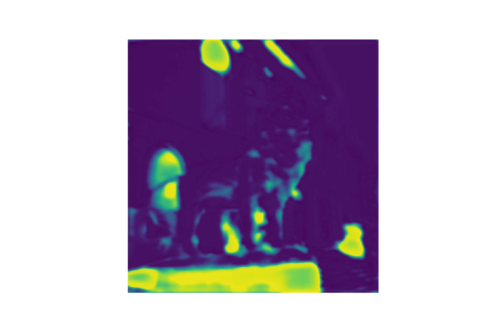

# Depth estimation based on dual camera images.

## Examples
| 0000.png                         | 0001.png                         | 0002.png                         |
| -------------------------------- | -------------------------------- | -------------------------------- |
|      |      |      |
|  |  |  |

## Results
Epoch: 39, loss=(total:0.0218) </br>
MSE=0.0097 RMSE=0.0964 MAE=0.0134 ABS_REL=0.0517 </br>
DELTA1.02=0.9680 DELTA1.05=0.9758 DELTA1.10=0.9807 </br>
DELTA1.25=0.9866 DELTA1.25^2=0.9911 DELTA1.25^3=0.9937

Trained on [bdataset_stereo](https://drive.google.com/drive/folders/1IlFDUHxvjXrwdo9GdHM764n9HKwnzfml) for 40 epochs using SGD.

Train Configuration
```yaml
LEARNING_RATE: 0.01
MOMENTUM: 0.9
DAMPENING: 0.1
WEIGHT_DECAY: 0.0001

MILESTONES: [10,20,30]
GAMMA: 0.2

NUM_EPOCHS: 40
```

**Google Colab** notebook: <a href="https://colab.research.google.com/github/alexjercan/depth-estimation/blob/master/tutorial.ipynb"></a>

## References
- [Du2Net: Learning Depth Estimation from Dual-Cameras and Dual-Pixels](https://arxiv.org/pdf/2003.14299.pdf) -> Dual camera input
- [StereoNet: Guided Hierarchical Refinement for Real-Time Edge-Aware Depth Prediction](https://arxiv.org/pdf/1807.08865.pdf) -> Shared weights for feature extraction in dual camera input
- [Depth Estimation via Affinity Learned with Convolutional Spatial Propagation Network](https://openaccess.thecvf.com/content_ECCV_2018/papers/Xinjing_Cheng_Depth_Estimation_via_ECCV_2018_paper.pdf) -> Uses UNet type architecture
- [Deeper Depth Prediction with Fully Convolutional Residual Networks](https://arxiv.org/pdf/1606.00373.pdf) -> BerHu Loss function for depth estimation
